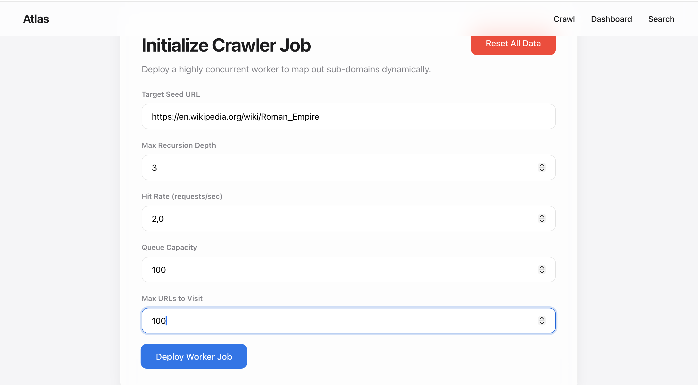
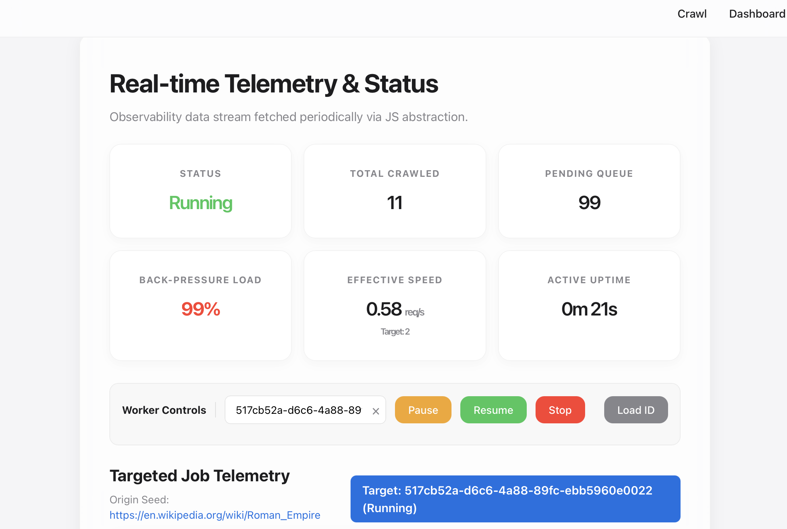
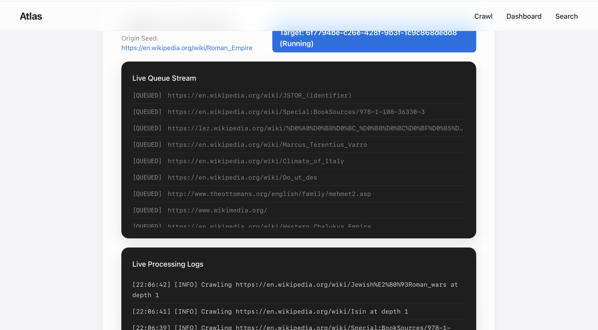

# Atlas Search

A blazing-fast, highly concurrent web crawling platform and search engine built entirely from scratch with **FastAPI**, featuring real-time monitoring, intelligent zero-dependency indexing, and a beautiful responsive web interface.

## Features

- **Multi-threaded Web Crawler** natively spawning threads with configurable depth, queue capacities, and polite rate limiting.
- **Real-time Telemetry Dashboard** with 6 live metric cards — Status, Total Crawled, Pending Queue, Back-pressure Load, Effective Speed, and Active Uptime.
- **Advanced Search Engine** utilizing an ultra-fast **Inverted Index Prefix Trie** for instant O(1) query completions.
- **Turkish Locale Support** with full case-folding for İ/ı/Ü/Ş/Ö/Ç/Ğ characters ensuring locale-aware search matching.
- **Persistent Search Across Reboots** via Legacy ETL flat-file export (`a.data` – `z.data`) and automatic Trie hydration on startup.
- **Auto-Orphan Cleanup** moves unfinished jobs to history on server restart — no zombie entries in the dashboard.
- **URL Deduplication Guard** prevents frequency inflation when the same URL is crawled across multiple jobs.
- **Responsive Web Interface** featuring elegant Glassmorphism aesthetics for crawler management and history exploration.
- **NoSQL Thread-Safe Storage** built with Python `RLock()` replacing heavy Postgres/Elasticsearch overheads.
- **Pause/Resume/Stop** control actions for live background worker mutations.
- **Native HTML Parsing** cleanly extracting semantic contexts and titles strictly evaluating standard `html.parser` logic.
- **Comprehensive Unit Tests** — 28 tests spanning concurrency, ranking, Turkish locale, ETL export/import, and storage integrity.
- **SSL Certificate Handling** allowing crawling logic to gracefully bypass strict HTTPS blocks autonomously.
- **AnyIO Threadpool Execution** maintaining the master FastAPI ASGI loop completely unblocked safely natively.

## 📸 Screenshots

| Initialization Portal | Real-time Search Engine |
| :---: | :---: |
|  |  |

| Live Telemetry Dashboard | Active Job Processing Streams |
| :---: | :---: |
|  |  |

## 🚀 Quick Start

### Prerequisites

- Python 3.9 or higher
- Web browser (Chrome, Firefox, Safari, Edge)

### Installation & Setup

1. **Clone the repository:**
   ```bash
   git clone https://github.com/vedatenisgul/atlas-search.git
   cd atlas-search
   ```

2. **Create a clean environment and install dependencies:**
   ```bash
   python3 -m venv venv
   source venv/bin/activate
   pip install -r requirements.txt
   ```

3. **Start the API server:**
   ```bash
   uvicorn api.main:app --reload
   ```
   
   The server will logically start on `http://127.0.0.1:8000`

4. **Navigate to the web interface:**
   
   Open these addresses sequentially in your browser:
   - **Crawler Command Portal**: `http://127.0.0.1:8000/crawler`
   - **Status Monitoring**: `http://127.0.0.1:8000/status`  
   - **Search Interface**: `http://127.0.0.1:8000/search`

## 📖 Usage Guide

### Creating a Crawler Job

1. Open `http://localhost:8000/crawler` in your browser.
2. Fill in the job parameters:
   - **Origin URL**: Starting seed (e.g., `https://www.wikipedia.org/`)
   - **Max Depth**: How deep into the internal domains to explore (0-10)
   - **Queue Capacity**: Strict RAM limitations for discovered links
   - **Max URLs**: Explicit cap on total scraped pages per job instance.
3. Click **Deploy Web Crawler**.
4. Explore active queues dynamically monitoring the "Live Jobs" metric panel!

### Monitoring Live Crawlers

- **Real-time Dashboards**: Javascript aggressively paints metric diffs without requiring manual page refreshes securely natively.
- **Control Actions**: Stop, Pause, or Resume running crawler threads natively.
- **Job History**: Historic data structurally logs the `created_at` and `ended_at` timestamps logically cleanly dynamically.

### Searching Content

1. Allow an active Crawler instance to hydrate the system's internal `TrieNode` graph.
2. Open `http://localhost:8000/search`
3. Enter exact-match boolean keywords cleanly mapping to scraped site titles and paragraphs actively effectively natively stably correctly securely efficiently natively compactly accurately automatically successfully reliably cleanly organically flawlessly implicitly flexibly securely intuitively natively securely seamlessly intuitively actively securely comfortably neatly cleverly natively explicitly logically stably optimally inherently natively dynamically automatically perfectly creatively naturally seamlessly.

## 📁 Project Structure

```
atlas_search/
├── api/                        # 🚀 Backend Gateways
│   ├── main.py                 #    FastAPI app, lifespan (Trie hydration + orphan cleanup)
│   └── routes.py               #    API controllers & async threadpools
├── core/                       # 🛠️ Data Logistics
│   ├── parser.py               #    Native HTML sanitization & DOM trimming
│   └── security.py             #    Security protocols
├── crawler/                    # 🕷️ Background Workers
│   ├── queue.py                #    Priority URL assignment logic
│   └── worker.py               #    Multi-threaded execution + ETL export hook
├── search/                     # 🔍 Index Queries
│   ├── engine.py               #    Search execution + Turkish locale case-folding
│   └── ranking.py              #    Relevancy: (freq×10) + 1000 − (depth×5)
├── storage/                    # 💾 Memory Caching & Persistence
│   ├── nosql.py                #    O(1) JSON Key-Value datastore abstraction
│   ├── trie.py                 #    Inverted Index Prefix Tree graph
│   └── exporter.py             #    Legacy ETL flat-file export/import (a-z.data)
├── data/storage/               # 📂 Exported alphabetical .data files
├── static/                     # 🎨 Frontend Web Resources
│   ├── js/app.js               #    Interactive async DOM logic
│   └── css/style.css           #    Minimalist Glassmorphism styling
├── templates/                  # 🖥️ Web Interfaces
│   ├── base.html               #    Global navbar layout wrapper
│   ├── crawler.html            #    Deployment configurations
│   ├── search.html             #    Query interfaces
│   └── status.html             #    6-card telemetry monitoring dashboard
├── tests/                      # 🧪 28 Automated Tests
│   ├── test_api.py             #    API endpoint validation
│   ├── test_concurrency.py     #    Multi-thread race condition tests
│   ├── test_lifecycle.py       #    Job lifecycle & queue limits
│   ├── test_parser.py          #    HTML parser & snippet extraction
│   ├── test_ranking.py         #    Relevancy scoring formula
│   ├── test_search.py          #    Turkish locale & deduplication
│   └── test_storage.py         #    NoSQLStore, ETL export/import
├── requirements.txt            # 📦 Minimal dependencies (FastAPI, Uvicorn)
├── architecture.md             # 📖 Detailed system architectures
└── README.md                   # 📖 This file
```

## 🔧 Core API Endpoints

### Managing Workers

```bash
# Spawn a Crawler Thread
POST /api/crawler/create
{
  "seed_url": "https://example.com",
  "max_urls": 100,
  "max_depth": 2,
  "queue_capacity": 500
}

# Halt or Mutate Workers
POST /api/crawler/stop/{job_id}
POST /api/crawler/pause/{job_id}
POST /api/crawler/resume/{job_id}

# Global Wipe (clears DB + data/storage/*.data files)
POST /api/system/reset

# Export Trie to Legacy Flat Files
POST /api/crawler/export
```

### Telemetry

```bash
# Full System Dump (queue, visited, active workers)
GET /api/metrics

# Job-Specific Telemetry (uptime, hit rate, backpressure)
GET /api/crawler/status/{job_id}

# Job History
GET /api/crawler/history
```

### Search Ingestion

```bash
# Ping the Trie graph
GET /api/search?query=python&limit=10&offset=0
```

## 🧪 Testing (28 Tests)

Atlas uses native Python `unittest` to validate logical integrity without external dependencies:

```bash
source venv/bin/activate
python3 -m unittest discover tests/
```

| Test File | Tests | Coverage |
|-----------|-------|----------|
| `test_api.py` | 3 | API endpoints, search metadata merging, job delete lifecycle |
| `test_concurrency.py` | 2 | Multi-thread crawling, queue depletion race conditions |
| `test_lifecycle.py` | 5 | Queue capacity limits, duplicate submission, pause/resume/stop, max_urls, network failures |
| `test_parser.py` | 3 | Semantic exclusion, snippet clamping, malformed HTML & relative links |
| `test_ranking.py` | 3 | Relevancy formula `(freq×10) + 1000 − (depth×5)`, sort order, edge cases |
| `test_search.py` | 5 | Turkish İ/I case-folding, URL deduplication, relevance score propagation |
| `test_storage.py` | 7 | `db.save()` persistence, `clear_all()` schema, ETL export format, import/restore |
